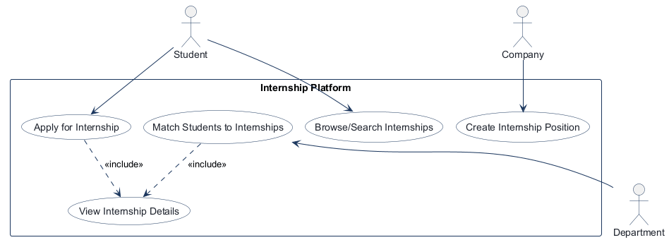
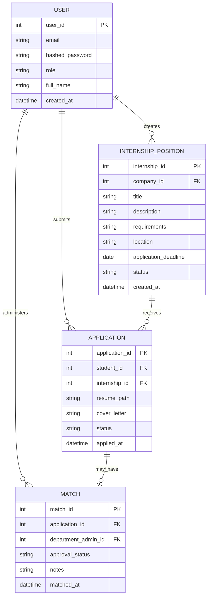

# COMP 3613 Assignment 1

Draft this file with the Guide. **Update it after every phase milestone** before you pause. The use-case diagram is a UML PNG at `docs/diagrams/use-case.png`, linked from this file as `diagrams/use-case.png` (path relative to `docs/report.md`). The model diagram is Mermaid. **Embed wireframe images** as `wireframes/<file>` (files live in `docs/wireframes/`).

Do not put your student ID in this file if you will commit it. The PDF cover adds your name and ID at export time.

## Assigned project
Internship Platform — a departmental system that takes student applications and distributes / matches them across internship positions offered by participating companies.

## Three workflows

### 1.
Apply for Internship (Student)

### 2.
Create Internship Position (Company)

### 3.
Match Students to Internships (Department)

## Use case diagram

Phase 2 decisions: Apply for Internship and Match Students to Internships each include View Internship Details. Student and Department both use View Internship Details. Browse/Search Internships is independently startable, with no include/extend link to Apply for Internship. No extend relationships were identified.

## Model diagram

Phase 3 first draft. Student, Company, and Department are role values on one User entity.

Relationship decisions: one Company user may create many positions; one Student user may submit many applications and each position may receive applications from many students. Each Application can have at most one Match. `company_id`, `student_id`, and `department_admin_id` reference User records with the corresponding role. Remaining rules not decided: allowed status values and whether a student may submit more than one application to the same position.

## Wireframes

### Internship Platform — Unified Role-Based Workflow

.png>)

### Wireframe coverage

<!-- student-build:wireframe-coverage
use_case: Browse/Search Internships
image: docs/wireframes/New board 1 (1).png
covered: yes
-->

<!-- student-build:wireframe-coverage
use_case: Apply for Internship
image: docs/wireframes/New board 1 (1).png
covered: yes
-->

<!-- student-build:wireframe-coverage
use_case: View Internship Details
image: docs/wireframes/New board 1 (1).png
covered: yes
-->

<!-- student-build:wireframe-coverage
use_case: Create Internship Position
image: docs/wireframes/New board 1 (1).png
covered: yes
-->

<!-- student-build:wireframe-coverage
use_case: Match Students to Internships
image: docs/wireframes/New board 1 (1).png
covered: yes
-->

### Phase 4 model revisions

- `INTERNSHIP_POSITION.application_deadline` — accepted model addition; seen on the new listing form.
- `INTERNSHIP_POSITION.status` — shown on recruiter listings, with a close-listing action.
- `APPLICATION.status` and `MATCH.approval_status` — reflected by pending, approved, and rejected matching views/actions.
- `USER.role` — reflected by the role-specific entry points from the unified login screen.
- `APPLICATION.resume_path` — accepted Phase 5 revision for storing the app-managed PDF resume path; applicant name and email use the signed-in `USER` profile.
- Position title, company, location, description/responsibilities, and requirements are shown in listing creation or browsing and map to existing model fields or the company relationship.
- Applicant full name and email map to existing `USER` fields; resume upload and cover letter map to existing `APPLICATION` fields. Applicant counts are derived from applications rather than stored as a separate field.

The combined image covers all named workflows. The student path is Browse/Search → View Details → Application Form → Submit; the previously confirmed outcome is a confirmation after submission. The detail-page content is not drawn as a separate screen, so implementation should provide that page without requiring another wireframe. The recruiter path shows listing creation and publishing back to the listing view. The department dashboard shows review/approve and reject actions, with pending/approved counts and status filtering.
## Theming

Branding: InternHub; professional tone; navy primary (`#17385c`), gold secondary (`#c99a37`), and grey-blue background (`#e8eef5`); Source Sans 3 typography. The logo is a briefcase linked to four surrounding dots.

Applied shared brand tokens and logo to the landing page, login, registration, and authenticated shell. Updated the landing/auth pages to InternHub copy and retained the existing account flows. The dashboard cards, navigation, buttons, and focus states use the same palette. Removed the unused generic starter `app.html` and `admin.html` shells; `/config` and its authentication remain.

## Implementation notes

One named workflow at a time. Include verify notes and polish / model revisions (Phase 5). Do not treat the first build as final.

### Updated wireframe review — Phase 5 in progress

Decisions: use the signed-in `USER` profile for application name/email; save the uploaded PDF in app-managed local storage and persist its path on `APPLICATION`. Local file storage is suitable for this coursework demo but is ephemeral on Render; durable deployment will need persistent/external file storage.
Duplicate policy: reject a second application from the same student to the same internship; preserve the original application.

Apply workflow implementation: the detail screen displays the company and internship details, accepts a PDF and cover letter, rejects duplicate submissions, stores generated resume files outside public static serving, and confirms success or expected validation errors. Application and detail routes require a student account.
Verification: student reports `python manage.py run` starts successfully; a valid PDF submission is validated, saved in local app-managed storage, recorded as an application, and receives success feedback. Duplicate/invalid-PDF cases and the visual comparison are not yet reported.
Polish: split the applicant profile display into separate read-only Full Name and Email fields to match the wireframe; the server continues to use the authenticated profile as the source of truth. Student confirmed the revised layout matches the desired design.

### Create Internship Position (Company) — in progress

Decision: a company must provide an application deadline before publishing a position.
Model revision: the deadline is date-only and required, matching the wireframe and the company's decision.
Implementation: the company-only route binds the required date, the service creates an open position, and the repository persists it. The form and listing view display the deadline and follow the wireframe's field order.
Verification: student reports company login and position creation work, and publishing without a deadline is blocked. Polish requested: add Manage/Edit and Close Listing actions under the company's postings to match the wireframe.
Manage/Edit behavior: open a dedicated edit page pre-filled with the selected position's current values.
Close Listing behavior: ask for confirmation, then set the listing status to closed; closed listings remain visible to their company but are removed from student browsing.
Polish implementation: company postings now expose Manage/Edit and confirmation-gated Close Listing actions. The edit page is pre-filled, and service/repository checks restrict updates and closure to the owning company.
Re-verification: student reports the edit and close buttons behave as chosen, and confirmed closed positions disappear from student browsing.
Additional recruiter-view polish: the Company sidebar shows Home, Manage Listings, and View Applications to match the wireframe. Manage Listings and View Applications are presentation-only menu items with no click behavior or implemented screens, as requested. Student reports no major mismatch against the recruiter wireframe.

### Match Students to Internships (Department) — in progress

Decision: record approval/rejection in `MATCH.approval_status`; leave `APPLICATION.status` independent.

<!-- student-build:code-check
workflow: Match Students to Internships (Department)
form: choice
layer: service
architecture_ok: yes
implement_confidence: 0.50
passed: yes
note: Student chose to keep application status independent from match approval status.
-->

<!-- student-build:code-check
workflow: Match Students to Internships (Department)
form: mcq
layer: service
architecture_ok: yes
implement_confidence: 0.55
passed: yes
note: Correctly placed coordination of a revised match decision in the service.
-->

<!-- student-build:code-check
workflow: Match Students to Internships (Department)
form: snippet
layer: model
architecture_ok: yes
implement_confidence: 0.55
passed: no
note: The Match-to-Application unique constraint remains to be completed in the marked SQLModel field.
-->

<!-- student-build:code-check
workflow: Match Students to Internships (Department)
form: snippet
layer: repository
architecture_ok: yes
implement_confidence: 0.40
passed: no
note: The marked MatchRepository lookup still raises NotImplementedError.
-->

<!-- student-build:code-check
workflow: Match Students to Internships (Department)
form: snippet
layer: service
architecture_ok: yes
implement_confidence: 0.40
passed: no
note: The marked create-or-revise decision logic remains incomplete.
-->

<!-- student-build:code-check
workflow: Match Students to Internships (Department)
form: snippet
layer: router
architecture_ok: yes
implement_confidence: 0.40
passed: no
note: The handler gap is present and contains no persistence logic.
-->

<!-- student-build:code-check
workflow: Match Students to Internships (Department)
form: review
layer: model
architecture_ok: yes
implement_confidence: 0.35
passed: no
note: Match.application_id still lacks the unique constraint required by the ERD.
-->

<!-- student-build:code-check
workflow: Match Students to Internships (Department)
form: review
layer: repository
architecture_ok: yes
implement_confidence: 0.40
passed: partial
note: Lookup by application_id is implemented, but the stale TODO/NotImplementedError remains after the return.
-->

<!-- student-build:code-check
workflow: Match Students to Internships (Department)
form: review
layer: service
architecture_ok: yes
implement_confidence: 0.30
passed: no
note: Existing matches are rejected rather than revised, contrary to the requested review flow.
-->

<!-- student-build:code-check
workflow: Match Students to Internships (Department)
form: review
layer: router
architecture_ok: yes
implement_confidence: 0.30
passed: no
note: Handler calls a service method that does not exist and still raises NotImplementedError.
-->

Matching implementation update: the student added the one-to-one `MATCH.application_id` constraint and implemented the repository lookup. The service validates the application and decision, creates a match for a first decision, and updates an existing match for a revised decision without changing `APPLICATION.status`. The department dashboard composes student, internship, company, and match data; displays the four wireframe counts; filters pending/approved/rejected/all; and provides approve/reject actions. The POST route delegates to the service and redirects with feedback.
Student verification: the student reports that the `/department` dashboard loads; all four counts and the status filter behave as expected; and approving, rejecting, and revising a decision work. The student also confirmed internship details expand on department review cards and the action is labeled "Approve Match". Admin login initially returned an Internal Server Error; an explicit `"pending"` filter fixed the department handler call, and the student confirmed the old admin path worked before choosing to remove the admin role and `/admin` route. Only Student, Company, and Department remain.

Test data update: `python manage.py init` and `python manage.py seed` create three students, two companies, one department account, five open internship positions, and five applications. The requested status mix is two pending/unmatched, two approved, and one rejected; repeated seeding preserves existing rows and decisions. An existing `admin` demo row is converted in place to `department`, preserving match foreign keys. Student confirms the admin role/path has been removed.
Student search implementation: the student chose case-insensitive partial matching, with Keyword across title, description, and requirements. The dashboard now includes Keyword, Company, and Location fields, preserves submitted filters, shows matching companies, and offers a clear-filters link for empty results. Repository filtering remains limited to open positions.
Verification: student reports the search runs fine and has no mismatch against the wireframe.
Student/Department sidebar polish: Student now sees a presentation-only Applications item beside Home; Department sees a presentation-only View Matches item beside Home. Neither has click behavior or an implemented screen. Student-run verification: the student confirms the new entries display, remain non-functional, and Home continues to work for all roles.

<!-- student-build:code-check
workflow: Browse/Search Internships (Student)
form: mcq
layer: service
architecture_ok: yes
implement_confidence: 0.55
passed: yes
note: Student selected the service to coordinate the keyword, company, and location search.
-->

<!-- student-build:code-check
workflow: Browse/Search Internships (Student)
form: choice
layer: other
architecture_ok: yes
implement_confidence: 0.60
passed: yes
note: Student chose keyword matching over title, description, and requirements.
-->

<!-- student-build:code-check
workflow: Browse/Search Internships (Student)
form: snippet
layer: repository
architecture_ok: yes
implement_confidence: 0.35
passed: no
note: The student referenced nonexistent InternshipPosition.company_name and searched only title, not the selected fields.
-->

<!-- student-build:code-check
workflow: Browse/Search Internships (Student)
form: snippet
layer: service
architecture_ok: yes
implement_confidence: 0.40
passed: yes
note: The service delegates the search to the position repository.
-->

<!-- student-build:code-check
workflow: Browse/Search Internships (Student)
form: snippet
layer: router
architecture_ok: yes
implement_confidence: 0.45
passed: yes
note: The student route binds all three query values and calls the service without persistence logic.
-->

<!-- student-build:code-check
workflow: Browse/Search Internships (Student)
form: snippet
layer: repository
architecture_ok: yes
implement_confidence: 0.25
passed: no
note: Second repository attempt uses an unimported or_ and compares the company text filter to company_id rather than company profile fields.
-->

<!-- student-build:code-check
workflow: Browse/Search Internships (Student)
form: open
layer: other
architecture_ok: yes
implement_confidence: 0.30
passed: yes
note: Student identified company_id as the position-to-company link and User.full_name as the company display field.
-->

<!-- student-build:code-check
workflow: Browse/Search Internships (Student)
form: snippet
layer: repository
architecture_ok: yes
implement_confidence: 0.20
passed: partial
note: Third repository attempt fixes the keyword scope and imports or_, but company filtering still compares numeric company_id to the text input; the User join is unused.
-->

<!-- student-build:code-check
workflow: Browse/Search Internships (Student)
form: snippet
layer: repository
architecture_ok: yes
implement_confidence: 0.15
passed: partial
note: Fourth attempt joins User, but uses user.full_name from the module rather than the model field; runtime confirms the module has no full_name attribute. Duplicate certifi.where imports are unrelated.
-->

<!-- student-build:code-check
workflow: Browse/Search Internships (Student)
form: snippet
layer: repository
architecture_ok: yes
implement_confidence: 0.10
passed: partial
note: The next edit removed unrelated imports but left the company predicate referencing user.full_name instead of the imported User model.
-->

<!-- student-build:code-check
workflow: Browse/Search Internships (Student)
form: review
layer: repository
architecture_ok: yes
implement_confidence: 0.20
passed: partial
note: Final review confirms the title/description/requirements and location filters plus the User join; integration corrected the model symbol and added username fallback for company-name search.
-->

<!-- student-build:code-check
workflow: Browse/Search Internships (Student)
form: review
layer: service
architecture_ok: yes
implement_confidence: 0.25
passed: yes
note: Service trims inputs, delegates search, and supplies company display names for the cards.
-->

<!-- student-build:code-check
workflow: Browse/Search Internships (Student)
form: review
layer: template
architecture_ok: yes
implement_confidence: 0.25
passed: yes
note: Search form matches the wireframe's keyword/company/location fields and retains the active filters.
-->

<!-- student-build:code-check
workflow: Browse/Search Internships (Student)
form: review
layer: template
architecture_ok: yes
implement_confidence: 0.30
passed: yes
note: Student ran the search flow and reported it works without a wireframe mismatch.
-->

<!-- student-build:code-check
workflow: Match Students to Internships (Department)
form: choice
layer: template
architecture_ok: yes
implement_confidence: 0.50
passed: yes
note: Student chose expandable internship details on each department dashboard card before a decision.
-->

<!-- student-build:code-check
workflow: Shared role-based entry points
form: choice
layer: other
architecture_ok: yes
implement_confidence: 0.50
passed: yes
note: Student chose to remove the admin role and /admin dashboard, retaining Student, Company, and Department.
-->

<!-- student-build:code-check
workflow: Match Students to Internships (Department)
form: review
layer: model
architecture_ok: yes
implement_confidence: 0.40
passed: yes
note: Student added the unique constraint to Match.application_id for the one-match-per-application rule.
-->

<!-- student-build:code-check
workflow: Match Students to Internships (Department)
form: review
layer: repository
architecture_ok: yes
implement_confidence: 0.45
passed: yes
note: Student implemented lookup of a Match by application_id; repository persistence remains outside the router.
-->

<!-- student-build:code-check
workflow: Match Students to Internships (Department)
form: review
layer: router
architecture_ok: yes
implement_confidence: 0.45
passed: partial
note: Student route attempt binds decision fields and delegates to the service without persistence logic; integration completed the success redirect.
-->

<!-- student-build:code-check
workflow: Match Students to Internships (Department)
form: review
layer: service
architecture_ok: yes
implement_confidence: 0.45
passed: yes
note: Integrated create-or-update behavior supports revised decisions and preserves Application.status.
-->

<!-- student-build:code-check
workflow: Create Internship Position (Company)
form: choice
layer: service
architecture_ok: yes
implement_confidence: 0.40
passed: yes
note: Student chose to require an application deadline at publication.
-->

<!-- student-build:code-check
workflow: Create Internship Position (Company)
form: mcq
layer: service
architecture_ok: yes
implement_confidence: 0.50
passed: yes
note: Correctly placed the listing acceptance decision in the service.
-->

<!-- student-build:code-check
workflow: Create Internship Position (Company)
form: snippet
layer: model
architecture_ok: yes
implement_confidence: 0.50
passed: yes
note: Added a required date-only application_deadline field to InternshipPositionBase.
-->

<!-- student-build:code-check
workflow: Create Internship Position (Company)
form: snippet
layer: repository
architecture_ok: yes
implement_confidence: 0.35
passed: no
note: The InternshipPositionRepository.create TODO and NotImplementedError remain.
-->

<!-- student-build:code-check
workflow: Create Internship Position (Company)
form: snippet
layer: service
architecture_ok: yes
implement_confidence: 0.40
passed: partial
note: The service constructs an open position with the required deadline and delegates to the repository; its TODO marker remains.
-->

<!-- student-build:code-check
workflow: Create Internship Position (Company)
form: snippet
layer: router
architecture_ok: yes
implement_confidence: 0.40
passed: partial
note: The handler binds a date and delegates to the service without persistence logic; a TODO marker remains.
-->

<!-- student-build:code-check
workflow: Create Internship Position (Company)
form: review
layer: repository
architecture_ok: yes
implement_confidence: 0.50
passed: yes
note: Student completed the create method with add, commit, refresh, and return.
-->

<!-- student-build:code-check
workflow: Create Internship Position (Company)
form: review
layer: service
architecture_ok: yes
implement_confidence: 0.50
passed: yes
note: Student constructs an open position with its required deadline and delegates persistence.
-->

<!-- student-build:code-check
workflow: Create Internship Position (Company)
form: review
layer: router
architecture_ok: yes
implement_confidence: 0.50
passed: yes
note: Student binds a required date and calls the service without SQL or persistence code.
-->

<!-- student-build:code-check
workflow: Create Internship Position (Company)
form: choice
layer: other
architecture_ok: yes
implement_confidence: 0.50
passed: yes
note: Student chose a dedicated pre-filled edit page.
-->

<!-- student-build:code-check
workflow: Create Internship Position (Company)
form: choice
layer: other
architecture_ok: yes
implement_confidence: 0.50
passed: yes
note: Student chose confirmation before closing a position.
-->

<!-- student-build:code-check
workflow: Create Internship Position (Company)
form: review
layer: template
architecture_ok: yes
implement_confidence: 0.50
passed: yes
note: Student verified company position creation and required-deadline behavior, then identified missing listing-management actions.
-->

<!-- student-build:code-check
workflow: Create Internship Position (Company)
form: review
layer: template
architecture_ok: yes
implement_confidence: 0.55
passed: yes
note: Student verified pre-filled editing and confirmation-gated closing, including removal from student browsing.
-->

- **Models:** `APPLICATION.resume_path` and `INTERNSHIP_POSITION.application_deadline` are now present in the SQLModel.
- **Schemas:** `app/schemas/internship.py` defines position/application fields. The detail form now submits the required multipart PDF upload.
- **Services:** application orchestration checks for a missing position and duplicate application, verifies PDF content, creates private `uploads/resumes/`, and stores generated filenames outside the publicly served static directory. Local storage is not durable on Render without persistent/external storage.
- **Repositories:** duplicate lookup is now implemented in `ApplicationRepository`.
- **Dependencies:** application viewing/submission require a student account, and company position creation/listing require a company account; department access checks remain unwired.
- **Routes and forms:** `internship_detail.html` uses multipart encoding and a PDF file input, matching the route's `UploadFile` parameter; it displays the company profile and signed-in applicant profile. The route delegates to the service, surfaces validation errors, and redirects after successful submission. Student application tracking, recruiter applicant counts, and department status/count views remain unwired.
- **Templates:** the current student, company, and department dashboards still omit several revised wireframe controls and screens, including student search/application tracking, recruiter applicant counts, and department counts/status filtering.

<!-- student-build:code-check
workflow: Apply for Internship (Student)
form: snippet
layer: model
architecture_ok: yes
implement_confidence: 0.45
passed: yes
note: Replaced the legacy resume URL with Application.resume_path; applicant identity remains on User.
-->

<!-- student-build:code-check
workflow: Apply for Internship (Student)
form: choice
layer: service
architecture_ok: yes
implement_confidence: 0.40
passed: yes
note: Student chose to reject duplicate submissions for one student/internship pair.
-->

<!-- student-build:code-check
workflow: Apply for Internship (Student)
form: snippet
layer: router
architecture_ok: yes
implement_confidence: 0.30
passed: partial
note: Route delegates to InternshipService without persistence logic, but does not handle service validation errors.
-->

<!-- student-build:code-check
workflow: Apply for Internship (Student)
form: snippet
layer: service
architecture_ok: yes
implement_confidence: 0.30
passed: no
note: TODO remains and the relative upload directory is not created before the file write.
-->

<!-- student-build:code-check
workflow: Apply for Internship (Student)
form: review
layer: router
architecture_ok: yes
implement_confidence: 0.40
passed: partial
note: Thin route and service delegation were present; integration narrowed error handling to expected validation failures.
-->

<!-- student-build:code-check
workflow: Apply for Internship (Student)
form: review
layer: service
architecture_ok: yes
implement_confidence: 0.40
passed: partial
note: Student wrote directory creation and a generated filename; integration moved private resumes out of static serving.
-->

<!-- student-build:code-check
workflow: Apply for Internship (Student)
form: snippet
layer: router
architecture_ok: yes
implement_confidence: 0.35
passed: no
note: UploadFile reaches the service, but FastAPI imports are invalid and the service still expects a URL.
-->

<!-- student-build:code-check
workflow: Apply for Internship (Student)
form: review
layer: repository
architecture_ok: yes
implement_confidence: 0.45
passed: yes
note: Duplicate lookup now queries by student_id and internship_id.
-->

<!-- student-build:code-check
workflow: Apply for Internship (Student)
form: review
layer: service
architecture_ok: yes
implement_confidence: 0.40
passed: partial
note: Missing-position and duplicate checks plus Application creation are present; FastAPI Path import breaks filesystem storage and PDF validation is absent.
-->

<!-- student-build:code-check
workflow: Apply for Internship (Student)
form: review
layer: router
architecture_ok: yes
implement_confidence: 0.40
passed: no
note: Template now submits multipart PDF and displays the User profile fields; invalid lowercase route imports remain.
-->

<!-- student-build:code-check
workflow: Apply for Internship (Student)
form: review
layer: template
architecture_ok: yes
implement_confidence: 0.40
passed: yes
note: Multipart encoding, PDF file input, and User.full_name/email display match the updated application flow.
-->

Skips: 3/3 used
- Repository/service implementation snippets — assumed the duplicate lookup and application coordination; the repository lookup was confirmed, and the student later attempted the service storage snippet.
- Service path/type correction — assumed filesystem-based storage and PDF validation; the implementation now uses `pathlib`, a generated filename, and private local storage.
- Thin-route rewrite — assumed a route would bind the PDF upload and delegate; the route now uses valid FastAPI imports, delegates to the service, and reports expected validation failures.

## Deployed app

Phase 6. Public Render URL (not localhost). Markers open this to mark the three workflows.

https://

## Logins

Demo accounts for local testing:

- bob / bobpass — Student
- alice / alicepass — Student
- carol / carolpass — Student
- brightpath / brightpathpass — Company
- northstar / northstarpass — Company
- department / departmentpass — Department

## YouTube URL

## Session transcripts

Filled when the Guide builds the report: the agent writes each Guide chat to `docs/transcripts/<slug>.md` (Copilot Agent, Cursor, or OpenCode). `python manage.py report` packages them. Do not paste chats here during the build.

## Competency (student-judge)

Filled when the report is built. Guide runs student-judge, writes `docs/judge.md`, and export appends the scorecard here.

## Skill integrity

Filled by `python manage.py report`. Do not edit the course skills.
